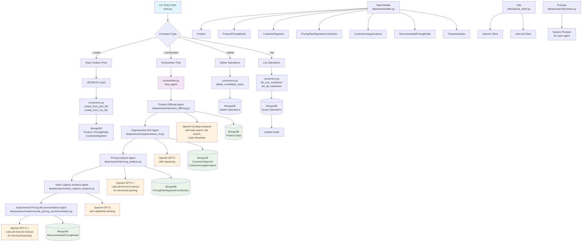

## Agent Purpose

**Transform AI pricing from guesswork to science with ROI-based optimization.**

For AI companies, traditional pricing models fail to capture your technology's true value. This intelligent agent analyzes your pricing ecosystem to deliver:
- **Segment-specific ROI analysis** for optimal pricing per customer type
- **Dynamic recommendations** based on usage patterns and value capture
- **A/B testing frameworks** for experimental validation
- **Data-driven strategies** that maximize revenue and reduce churn

### Essential Documentation Required

#### 📋 Product Docs
- ICP descriptions with use cases
- Feature catalogs with value propositions
- Customer success stories with ROI metrics

#### 🏗️ Infrastructure Docs
- Usage metrics and cost structures
- Scalability constraints and benchmarks
- Integration requirements

#### 🤖 AI Usage Docs
- Model performance metrics
- Token consumption patterns
- Usage analytics and adoption data

**Ready to optimize your AI pricing?** Follow the setup instructions below.


## Agent Architecture

This diagram illustrates the complete workflow of the AI Pricing Research Consultant, showing how data flows through various specialized agents to deliver comprehensive pricing recommendations.

The architecture follows a modular design with clear separation of concerns:
- Data ingestion and storage layers
- Specialized AI agents for different analysis phases
- Orchestration layer coordinating the workflow
- Multiple AI model integrations for optimal performance

Each agent is designed to handle specific aspects of pricing analysis, from initial product offering assessment to experimental recommendation generation.



### Key Architecture Components

**Data Layer**: MongoDB serves as the central data repository with structured collections for products, customer segments, pricing models, and analysis results.

**AI Integration Layer**: Multiple AI models are strategically used - GPT-5 for complex reasoning, o3-deep-research for comprehensive analysis.

**Agent Orchestration**: The orchestrator coordinates the sequential execution of specialized agents, ensuring data flows correctly between analysis phases.

**CLI Interface**: Simple command-line interface provides easy access to all functionality while maintaining the sophisticated AI processing underneath.

## How to use it?

### Prerequisites

```bash
# Install dependencies
python3 -m venv venv
source venv/bin/activate
pip install -r requirements.txt

# Set API keys
export OPENAI_API_KEY="your-openai-api-key"
export TOGETHER_API_KEY="your-together-ai-api-key"

# Optional: Set MongoDB connection
export MONGODB_URI="mongodb://localhost:27017/pricing-research"  # or your Atlas URI
```

**MongoDB Options:**
- **Local**: Install MongoDB and run `mongod`
- **Cloud**: Use MongoDB Atlas and set `MONGODB_URI`
- **Docker**: `docker run -d -p 27017:27017 mongo:latest`

### Usage

```bash
# Create data from JSON/CSV
python main.py --create path/to/your/data.json

# Run pricing analysis
python main.py --orchestrator product_id

# List data
python main.py --list collection_name

# Delete data
python main.py --delete collection_name document_id
```
