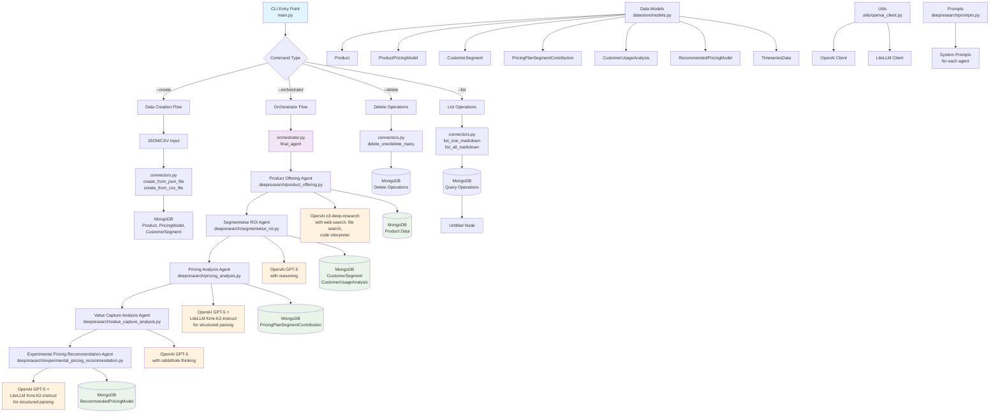

## Agent Purpose

**Transform AI pricing from guesswork to science with ROI-based optimization.**

For AI companies, traditional pricing models fail to capture your technology's true value. This intelligent agent analyzes your pricing ecosystem to deliver:
- **Segment-specific ROI analysis** for optimal pricing per customer type
- **Dynamic recommendations** based on usage patterns and value capture
- **A/B testing frameworks** for experimental validation
- **Data-driven strategies** that maximize revenue and reduce churn

### Essential Documentation Required

#### 📋 Product Docs
- ICP descriptions with use cases
- Feature catalogs with value propositions
- Customer success stories with ROI metrics

#### 🏗️ Infrastructure Docs
- Usage metrics and cost structures
- Scalability constraints and benchmarks
- Integration requirements

#### 🤖 AI Usage Docs
- Model performance metrics
- Token consumption patterns
- Usage analytics and adoption data

**Ready to optimize your AI pricing?** Follow the setup instructions below.


## Agent Architecture

This diagram illustrates the complete workflow of the AI Pricing Research Consultant, showing how data flows through various specialized agents to deliver comprehensive pricing recommendations.

The architecture follows a modular design with clear separation of concerns:
- Data ingestion and storage layers
- Specialized AI agents for different analysis phases
- Orchestration layer coordinating the workflow
- Multiple AI model integrations for optimal performance

Each agent is designed to handle specific aspects of pricing analysis, from initial product offering assessment to experimental recommendation generation.



### Key Architecture Components

**Data Layer**: MongoDB serves as the central data repository with structured collections for products, customer segments, pricing models, and analysis results.

**AI Integration Layer**: Multiple AI models are strategically used - GPT-5 for complex reasoning, o3-deep-research for comprehensive analysis.

**Agent Orchestration**: The orchestrator coordinates the sequential execution of specialized agents, ensuring data flows correctly between analysis phases.

**CLI Interface**: Simple command-line interface provides easy access to all functionality while maintaining the sophisticated AI processing underneath.

## Data Format Requirements

Before using the pricing consultant, you need to prepare your product, pricing, and customer data in either JSON or CSV format. Both formats support the same underlying data structure.

### JSON Format

The JSON format organizes data into three main sections: `product`, `pricing_model`, and `customer_segments`.

**Required Structure:**
```json
{
  "product": {
    "name": "Your Product Name",
    "icp_description": "Ideal Customer Profile description",
    "unit_level_cogs": "Cost of goods sold details",
    "features_description_summary": "Summary of key features and capabilities",
    "product_documentations": ["https://docs.example.com", "https://api.example.com"]
  },
  "pricing_model": {
    "unit_price": 99.0,
    "min_unit_count": 1,
    "unit_calculation_logic": "per_seat",
    "min_unit_utilization_period": "monthly"
  },
  "customer_segments": [
    {
      "customer_segment_uid": "enterprise",
      "customer_segment_name": "Enterprise Customers",
      "customer_segment_description": "Large organizations with 500+ employees",
      "number_of_active_subscriptions": 50,
      "number_of_active_subscriptions_forecast": 75,
      "usage_analyses": [
        {
          "customer_uid": "customer_001",
          "customer_task_to_agent": "Automated customer support and FAQ handling",
          "predicted_customer_satisfaction_response": 8.5,
          "predicted_customer_satisfaction_response_reasoning": "High satisfaction due to reduced response time and 24/7 availability"
        }
      ]
    }
  ]
}
```

### CSV Format

The CSV format flattens all data into rows, where each row can represent a customer usage analysis. Product and pricing data are repeated across rows.

**Required Columns:**
- `product_name` - Product name (required)
- `icp_description` - Ideal customer profile
- `unit_level_cogs` - Cost of goods sold
- `features_description_summary` - Feature summary
- `product_documentations` - URLs separated by `;` or `,`
- `unit_price` - Price per unit (numeric)
- `min_unit_count` - Minimum units (numeric)
- `unit_calculation_logic` - Pricing logic (e.g., "per_seat", "per_usage")
- `min_unit_utilization_period` - Billing period (e.g., "monthly", "yearly")
- `customer_segment_uid` - Unique segment ID (required)
- `customer_segment_name` - Human-readable segment name
- `customer_segment_description` - Segment description
- `number_of_active_subscriptions` - Current active subscriptions (numeric)
- `number_of_active_subscriptions_forecast` - Forecasted subscriptions (numeric)
- `customer_uid` - Individual customer ID
- `customer_task_to_agent` - Task description for the customer
- `predicted_customer_satisfaction_response` - Satisfaction score (numeric 0-10)
- `predicted_customer_satisfaction_response_reasoning` - Reasoning for satisfaction score

**Example CSV:**
```csv
product_name,icp_description,unit_level_cogs,features_description_summary,product_documentations,unit_price,min_unit_count,unit_calculation_logic,min_unit_utilization_period,customer_segment_uid,customer_segment_name,customer_segment_description,number_of_active_subscriptions,number_of_active_subscriptions_forecast,customer_uid,customer_task_to_agent,predicted_customer_satisfaction_response,predicted_customer_satisfaction_response_reasoning
AI Assistant Pro,Tech-savvy businesses needing AI automation,$5 per 1000 queries,Advanced NLP with custom training capabilities,https://docs.example.com;https://api.example.com,99.0,1,per_seat,monthly,enterprise,Enterprise Customers,Large organizations with 500+ employees,50,75,customer_001,Automated customer support and FAQ handling,8.5,High satisfaction due to reduced response time and 24/7 availability
```

### Field Descriptions

**Product Fields:**
- `name` / `product_name`: Your product's name (required)
- `icp_description`: Description of your ideal customer profile
- `unit_level_cogs`: Detailed cost structure per unit
- `features_description_summary`: Key features and value propositions
- `product_documentations`: URLs to product docs, APIs, or resources

**Pricing Model Fields:**
- `unit_price`: Price per billing unit (default: 99.0)
- `min_unit_count`: Minimum units required (default: 1)
- `unit_calculation_logic`: How units are calculated ("per_seat", "per_usage", etc.)
- `min_unit_utilization_period`: Billing frequency ("monthly", "yearly", etc.)

**Customer Segment Fields:**
- `customer_segment_uid`: Unique identifier for the segment (required for CSV)
- `customer_segment_name`: Descriptive name for the segment
- `customer_segment_description`: Detailed segment characteristics
- `number_of_active_subscriptions`: Current subscription count
- `number_of_active_subscriptions_forecast`: Projected future subscriptions

**Usage Analysis Fields:**
- `customer_uid`: Individual customer identifier
- `customer_task_to_agent`: Description of tasks the customer performs
- `predicted_customer_satisfaction_response`: Satisfaction score (0-10)
- `predicted_customer_satisfaction_response_reasoning`: Explanation for the score

### Important Notes

- **Required Fields**: Product name is mandatory. For CSV, `customer_segment_uid` is also required.
- **Multiple Segments**: JSON supports multiple segments in an array. CSV uses one row per customer usage analysis.
- **Documentation URLs**: Product documentation URLs help the AI understand your product better for more accurate pricing recommendations.
- **Numeric Fields**: Ensure satisfaction scores, pricing, and subscription counts are valid numbers.

## How to use it?

### Prerequisites

```bash
# Install dependencies
python3 -m venv venv
source venv/bin/activate
pip install -r requirements.txt

# Set API keys
export OPENAI_API_KEY="your-openai-api-key"
export TOGETHER_API_KEY="your-together-ai-api-key"

# Optional: Set MongoDB connection
export MONGODB_URI="mongodb://localhost:27017/pricing-research"  # or your Atlas URI
```

**MongoDB Options:**
- **Local**: Install MongoDB and run `mongod`
- **Cloud**: Use MongoDB Atlas and set `MONGODB_URI`
- **Docker**: `docker run -d -p 27017:27017 mongo:latest`

### Usage

```bash
# Create data from JSON/CSV
python main.py --create path/to/your/data.json

# Run pricing analysis
python main.py --orchestrator product_id

# List data
python main.py --list collection_name

# Delete data
python main.py --delete collection_name document_id
```
