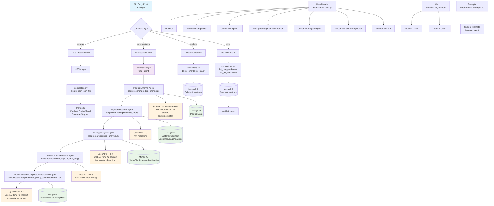

## Agent Purpose

**Transform AI pricing from guesswork to science with ROI-based optimization.**

For AI companies, traditional pricing models fail to capture your technology's true value. This intelligent agent analyzes your pricing ecosystem to deliver:
- **Segment-specific ROI analysis** for optimal pricing per customer type
- **Dynamic recommendations** based on usage patterns and value capture
- **A/B testing frameworks** for experimental validation
- **Data-driven strategies** that maximize revenue and reduce churn

### Essential Documentation Required

#### 📋 Product Docs
- ICP descriptions with use cases
- Feature catalogs with value propositions
- Customer success stories with ROI metrics

#### 🏗️ Infrastructure Docs
- Usage metrics and cost structures
- Scalability constraints and benchmarks
- Integration requirements

#### 🤖 AI Usage Docs
- Model performance metrics
- Token consumption patterns
- Usage analytics and adoption data

**Ready to optimize your AI pricing?** Follow the setup instructions below.


## Agent Architecture

This diagram illustrates the complete workflow of the AI Pricing Research Consultant, showing how data flows through various specialized agents to deliver comprehensive pricing recommendations.

The architecture follows a modular design with clear separation of concerns:
- Data ingestion and storage layers
- Specialized AI agents for different analysis phases
- Orchestration layer coordinating the workflow
- Multiple AI model integrations for optimal performance

Each agent is designed to handle specific aspects of pricing analysis, from initial product offering assessment to experimental recommendation generation.



### Key Architecture Components

**Data Layer**: MongoDB serves as the central data repository with structured collections for products, customer segments, pricing models, and analysis results.

**AI Integration Layer**: Multiple AI models are strategically used - GPT-5 for complex reasoning, o3-deep-research for comprehensive analysis.

**Agent Orchestration**: The orchestrator coordinates the sequential execution of specialized agents, ensuring data flows correctly between analysis phases.

**CLI Interface**: Simple command-line interface provides easy access to all functionality while maintaining the sophisticated AI processing underneath.

## Data Format Requirements

Before using the pricing consultant, prepare your product, pricing, and customer data in JSON format.

### JSON Format

The JSON format organizes data into three main sections: `product`, `pricing_model`, and `customer_segments`.

**Required Structure:**
```json
{
  "product": {
    "name": "Your Product Name",
    "icp_description": "Ideal Customer Profile description",
    "unit_level_cogs": "Cost of goods sold details",
    "features_description_summary": "Summary of key features and capabilities",
    "product_documentations": ["https://docs.example.com", "https://api.example.com"]
  },
  "pricing_model": {
    "unit_price": 99.0,
    "min_unit_count": 1,
    "unit_calculation_logic": "per_seat",
    "min_unit_utilization_period": "monthly"
  },
  "customer_segments": [
    {
      "customer_segment_uid": "enterprise",
      "customer_segment_name": "Enterprise Customers",
      "customer_segment_description": "Large organizations with 500+ employees",
      "number_of_active_subscriptions": 50,
      "number_of_active_subscriptions_forecast": 75,
      "usage_analyses": [
        {
          "customer_uid": "customer_001",
          "customer_task_to_agent": "Automated customer support and FAQ handling",
          "predicted_customer_satisfaction_response": 8.5,
          "predicted_customer_satisfaction_response_reasoning": "High satisfaction due to reduced response time and 24/7 availability"
        }
      ]
    }
  ]
}
```

 

### Field Descriptions

**Product Fields:**
- `name` / `product_name`: Your product's name (required)
- `icp_description`: Description of your ideal customer profile
- `unit_level_cogs`: Detailed cost structure per unit
- `features_description_summary`: Key features and value propositions
- `product_documentations`: URLs to product docs, APIs, or resources

**Pricing Model Fields:**
- `unit_price`: Price per billing unit (default: 99.0)
- `min_unit_count`: Minimum units required (default: 1)
- `unit_calculation_logic`: How units are calculated ("per_seat", "per_usage", etc.)
- `min_unit_utilization_period`: Billing frequency ("monthly", "yearly", etc.)

**Customer Segment Fields:**
- `customer_segment_uid`: Unique identifier for the segment (required for CSV)
- `customer_segment_name`: Descriptive name for the segment
- `customer_segment_description`: Detailed segment characteristics
- `number_of_active_subscriptions`: Current subscription count
- `number_of_active_subscriptions_forecast`: Projected future subscriptions

**Usage Analysis Fields:**
- `customer_uid`: Individual customer identifier
- `customer_task_to_agent`: Description of tasks the customer performs
- `predicted_customer_satisfaction_response`: Satisfaction score (0-10)
- `predicted_customer_satisfaction_response_reasoning`: Explanation for the score

### Important Notes

- **Required Fields**: Product name is mandatory.
- **Multiple Segments**: JSON supports multiple segments in an array.
- **Documentation URLs**: Product documentation URLs help the AI understand your product better for more accurate pricing recommendations.
- **Numeric Fields**: Ensure satisfaction scores, pricing, and subscription counts are valid numbers.

## Getting Started

### Quick Setup

#### Prerequisites
```bash
# 1. Set up environment variables
export OPENAI_API_KEY="your-openai-api-key"
export MONGODB_URI="mongodb://localhost:27017/pricing_research"  # Optional

# 2. Install dependencies
python3 -m venv venv
source venv/bin/activate
pip install -r requirements.txt

# 3. Start MongoDB (choose one option):
# Option A: Local MongoDB
mongod

# Option B: Docker
docker run -d -p 27017:27017 mongo:latest

# Option C: Use MongoDB Atlas (set MONGODB_URI to your Atlas connection string)
```

#### One-Command Setup and Run
```bash
# This will populate data and run a complete pricing experiment
python setup_and_run.py
```

### Usage Methods

#### Command Line Interface
```bash
# Create data from JSON
python main.py --create path/to/your/data.json

# Run pricing analysis
python main.py --orchestrator product_id

# List data
python main.py --list collection_name

# Delete data
python main.py --delete collection_name document_id
```

#### Individual Scripts
```bash
# Load product data from product_data.json into MongoDB
python populate_data.py

# List available products
python run_experiment.py --list-products

# List existing experiments
python run_experiment.py --list-experiments

# Run a new experiment
python run_experiment.py --product-id <PRODUCT_ID> \
  --objective "Optimize pricing for enterprise customers" \
  --usecase "B2B SaaS pricing strategy"
```

#### Web Interface
```bash
# Start the web server
python main.py

# Access at http://localhost:8000
# API docs at http://localhost:8000/docs
```

### Workflow Stages

The pricing research workflow progresses through these stages:

1. **segments_loaded** - Load and analyze customer segments
2. **positioning_usage_analysis_done** - Analyze product positioning and usage patterns
3. **roi_gap_analyzer_run** - Identify ROI gaps and opportunities
4. **experimental_plan_generated** - Generate experimental pricing plans
5. **simulations_run** - Run pricing simulations
6. **scenario_builder_completed** - Build different pricing scenarios
7. **cashflow_feasibility_runs_completed** - Analyze cashflow feasibility
8. **completed** - Experiment completed and ready for review

### Example Workflow

```bash
# 1. Complete setup and first run
python setup_and_run.py

# 2. Run additional experiments with different parameters
python run_experiment.py --product-id <ID> \
  --objective "Test freemium conversion rates" \
  --usecase "Freemium to paid optimization"

# 3. Start web interface for management
python main.py
```

### Output

Each experiment generates:
- **Positioning analysis** - Market positioning insights
- **Usage patterns** - Customer usage analysis
- **ROI gaps** - Identified revenue opportunities
- **Pricing recommendations** - Experimental pricing strategies
- **Simulation results** - Projected outcomes
- **Cashflow analysis** - Financial feasibility assessment

Results are stored in MongoDB and can be accessed via the web interface or directly through the database.

### Troubleshooting

#### MongoDB Connection Issues
```bash
# Check if MongoDB is running
mongod --version

# For Docker:
docker ps | grep mongo

# Test connection
python -c "import mongoengine; mongoengine.connect('mongodb://localhost:27017/test')"
```

#### Missing Dependencies
```bash
pip install -r requirements.txt
```

#### API Key Issues
```bash
# Verify your OpenAI API key
echo $OPENAI_API_KEY

# Test API access
python -c "from openai import OpenAI; client = OpenAI(); print('API key works!')"
```

## Advanced Deployment

### GitHub to Lambda Deployment

This system automatically deploys GitHub repositories to AWS Lambda functions with scheduled execution every 120 seconds and comprehensive CloudWatch monitoring.

#### Environment Setup

Copy the `environment.example` file to create your environment configuration:

```bash
cp environment.example .env
```

#### Required Environment Variables

**AWS Configuration:**
```bash
AWS_ACCESS_KEY_ID=your_aws_access_key
AWS_SECRET_ACCESS_KEY=your_aws_secret_key
AWS_DEFAULT_REGION=us-east-1
```

**Lambda Execution Role:**
Create an IAM role with the following policies:
- `AWSLambdaBasicExecutionRole`
- `CloudWatchEventsFullAccess` (for EventBridge integration)
- Custom policies as needed for your Lambda functions

```bash
LAMBDA_EXECUTION_ROLE_ARN=arn:aws:iam::123456789012:role/lambda-execution-role
```

**CloudWatch Monitoring (Optional):**
```bash
ENABLE_CLOUDWATCH_ALARMS=true
ALARM_EMAIL_ENDPOINT=admin@yourcompany.com
CLOUDWATCH_ALARM_SNS_TOPIC_ARN=arn:aws:sns:us-east-1:123456789012:lambda-alerts
```

#### IAM Permissions Required

The AWS user/role needs the following permissions:

**Lambda Permissions:**
- `lambda:CreateFunction`
- `lambda:UpdateFunctionCode`
- `lambda:GetFunction`
- `lambda:AddPermission`

**EventBridge Permissions:**
- `events:PutRule`
- `events:PutTargets`
- `events:DescribeRule`

**CloudWatch Permissions (if alarms enabled):**
- `cloudwatch:PutMetricAlarm`
- `sns:CreateTopic`
- `sns:Subscribe`

**S3 Permissions (if using deployment bucket):**
- `s3:GetObject`
- `s3:PutObject`

#### Deployment API Usage

**Deploy a GitHub Repository:**
```bash
curl -X POST "http://localhost:8000/deploy-github-to-lambda" \
  -H "Content-Type: application/json" \
  -d '{
    "github_url": "https://github.com/username/repository"
  }'
```

**Check Deployment Status:**
```bash
curl "http://localhost:8000/lambda-deployment-status/github-deploy-repository"
```

#### CloudWatch Alarms

When `ENABLE_CLOUDWATCH_ALARMS=true`, the following alarms are automatically created:

1. **Error Alarm**: Triggers when Lambda function has any errors
2. **Duration Alarm**: Triggers when execution time exceeds 80% of timeout
3. **Throttle Alarm**: Triggers when Lambda function is throttled

#### Deployment Troubleshooting

**Common Issues:**

1. **Role ARN Missing**: Ensure `LAMBDA_EXECUTION_ROLE_ARN` is set
2. **Permission Denied**: Check IAM permissions listed above
3. **Git Clone Failed**: Ensure repository is public or GitHub token is configured
4. **Alarm Creation Failed**: Check CloudWatch and SNS permissions

**Log Locations:**
- Lambda execution logs: CloudWatch Logs `/aws/lambda/{function-name}`
- Deployment logs: Application logs
- Alarm notifications: SNS topic configured

#### Security Best Practices

1. Use IAM roles instead of access keys when running on EC2
2. Rotate access keys regularly
3. Use least privilege principle for IAM permissions
4. Store sensitive environment variables securely
5. Enable CloudTrail for audit logging
